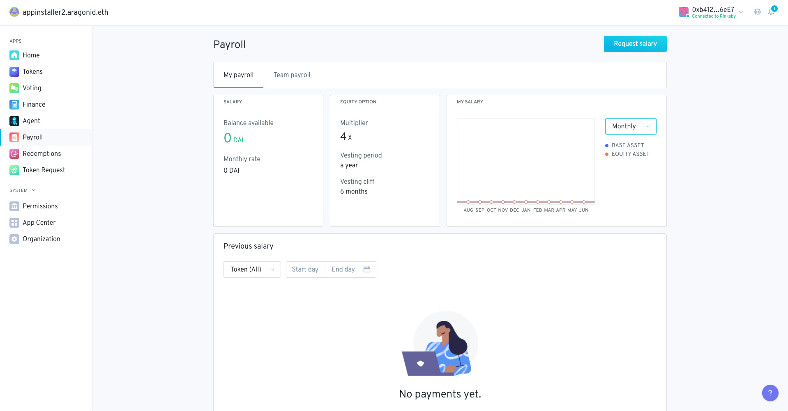

# Payroll 

_**Original code:**_ [aragon-apps/apps/payroll](https://github.com/aragon/aragon-apps/tree/master/future-apps/payroll)

<a href="https://installer.1hive.org"></a>

The purpose of the Payroll app is to implement a Payroll system in base asset, equity asset or a mix of both.

#### 🐲 Project Stage: development

The Payroll app is still in development. If you are interested in contributing please see our [open issues](https://github.com/1hive/payroll-app).

#### 🚨 Security Review Status: pre-audit

The code in this repository has not been audited.

## How to run Payroll app locally

To use this Aragon application, set it up using a tokens and finance app using:

```sh
yarn install
yarn start
```

If everything is working correctly, your new DAO will be deployed and your browser will open http://localhost:3000/#/YOUR-DAO-ADDRESS.

### Initialization

Initializing a Payroll app requires the following parameters:

- **Finance**: A reference to [Finance](https://github.com/aragon/aragon-apps/tree/master/apps/finance) instance that Payroll app will use to pay salaries. Finance in turn will use [Vault](https://github.com/aragon/aragon-apps/tree/master/apps/vault) to access funds, but going through Finance will have everything properly accounted for.
- **Denomination token**: Address of the denomination token used for salary accounting
- **Equity token manager**: A reference to the installed [Tokens app](https://github.com/aragon/aragon-apps/tree/master/apps/token-manager) instance this Payroll app will rely on for equity payments.
- **Vesting length**: The length of vestings in seconds, the time when vestings can be completely claimed. Set to 0 to disable vestings
- **Vesting cliff length**: The vesting cliff in seconds, the time until which vestings cannot be claimed
- **Vesting revokable**: Whether vestings can be revoked

Employees will be able to choose payment in denomination token, equity token or a mix of both. Equity payments are a multiple of the base currency amount which is defined by the equity multiplier. Equity payments can also be vested by enabling vestings.

### Lifecycle


#### Add employee
Three options can be used:
```
payroll.addEmployee(address _accountAddress, uint256 _initialDenominationSalary,  uint64 _startDate, string _role)
```
Add employee to the organization. Start date is used as the initial payment day. It needs `ADD_EMPLOYEE_ROLE`.

#### Modify employee salary
```
payroll.setEmployeeSalary(uint256 _employeeId, uint256 _denominationSalary)
```
It needs `SET_EMPLOYEE_SALARY_ROLE`.

#### Terminate employee
```
payroll.terminateEmployee(uint256 _employeeId, uint64 _endDate)
```

Remove employee from organization. Owed salary will accrue until termination date. It needs `TERMINATE_EMPLOYEE_ROLE`.

#### Request payroll
```
payroll.payday(uint256 _denominationTokenAllocation, int256 _requestedAmount, string _metaData)
```
Employees can request payroll whenever they want and the proportional amount of their anual salary since the last request (or since the start date if it's the first one) will be transferred.
Employees can choose to receive payment in base asset (denomination token), equity asset, or a mix of both. `_denominationTokenAllocation` determines the % of base asset payment from the total owed and the remaining will be paid in equity asset. The equity token payment is relative to the base asset payment and is defined by the equity multiplier. E.g If an employee has a salary of 1000 DAI and the multiplier is 4x then they can mint up to 4000 of the equity asset per period.

#### Change account address
```
payroll.changeAddressByEmployee(address _newAccountAddress)
```
Employees can change their own address.

### Caveats

- Requesting any salary under the total available will forfeit the remainder.
- If there are not enough funds in the orgs vault for the denomination token, `payday` will fail.
- For equity payments with vestings: If the tokens app holds less tokens than requested equity amount, `payday` will fail.


## Contributing

We welcome community contributions!

Please check out our [open Issues](https://github.com/1Hive/payroll-app/issues) to get started.

If you discover something that could potentially impact security, please notify us immediately. The quickest way to reach us is via the #payroll channel in our [team Keybase chat](https://1hive.org/contribute/keybase). Just say hi and that you discovered a potential security vulnerability and we'll DM you to discuss details.
